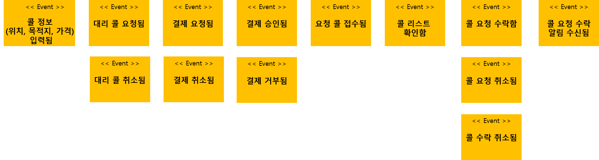
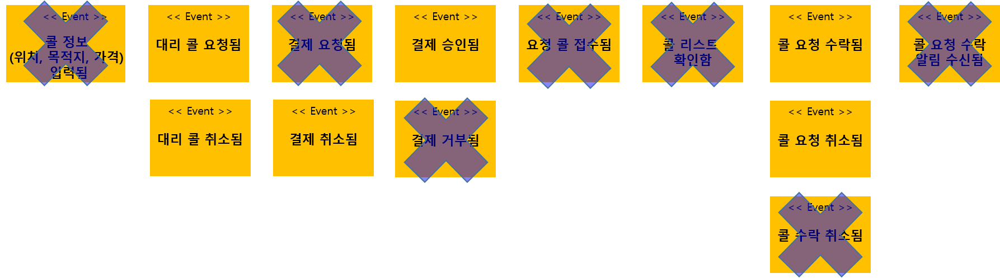
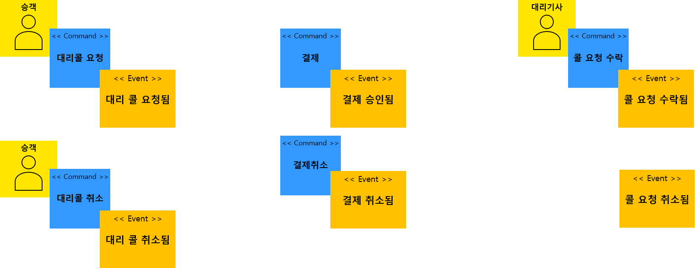
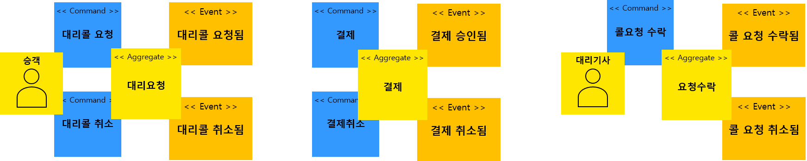
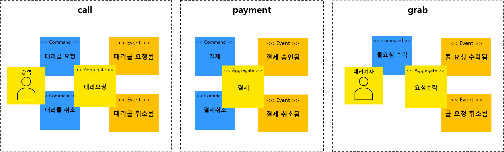
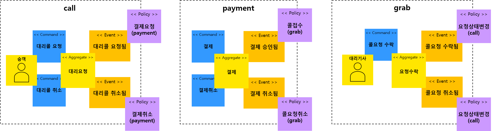
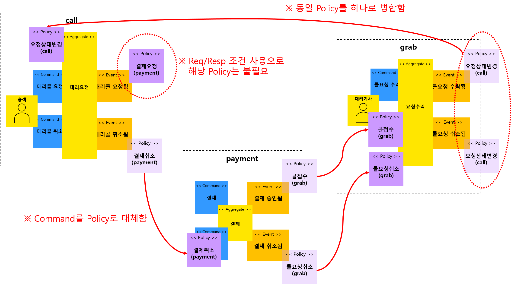
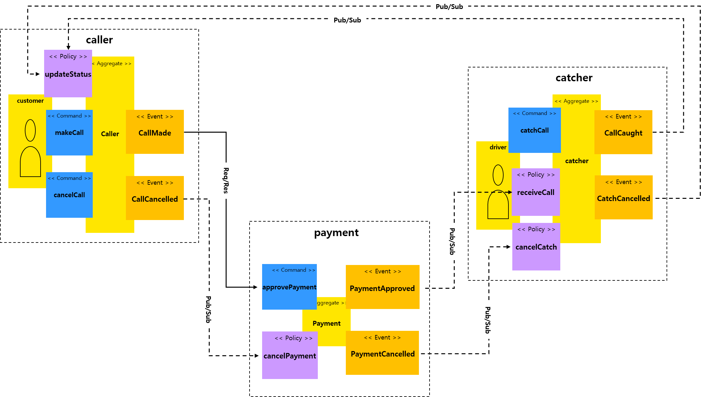
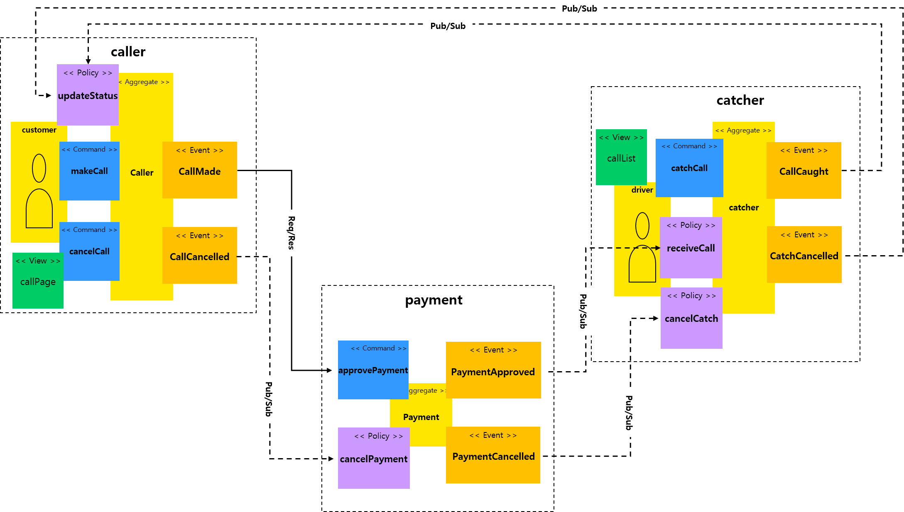
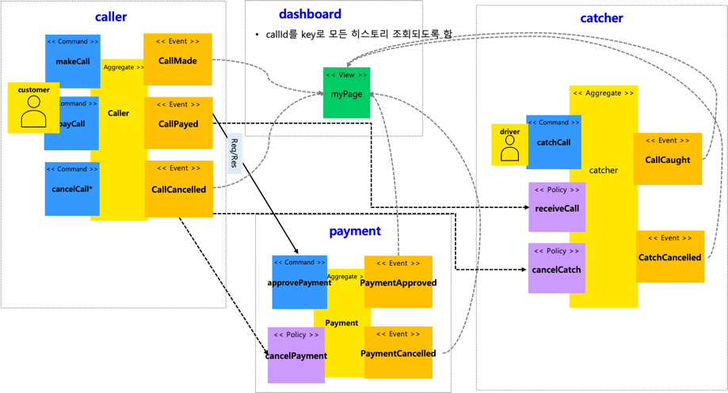

# Driver-Call (대리기사 콜 서비스)

# Table of contents

- [대리콜 (Driver-Call) 서비스]
  - [서비스 시나리오 및 요구사항 분석](#서비스-시나리오-및-요구사항-분석)
    - 서비스 개요 및 시나리오
    - 요구사항
  - [체크포인트](#체크포인트)
  - [분석/설계](#분석설계)
    - 개요 및 구성 목표
    - 서비스 설계를 위한 Event Storming
    - 헥사고날 아키텍처 다이어그램 도출
  - [구현방안 및 검증](#구현방안-및-검증)
    - DDD 의 적용
    - 폴리글랏 퍼시스턴스
    - 동기식 호출 과 Fallback 처리
    - 비동기식 호출 / 시간적 디커플링 / 장애격리 / 최종 (Eventual) 일관성
    - SAGA / Correlation
    - CQRS
  - [베포 및 운영](#베포-및-운영)
    - CI/CD 설정
    - 동기식 호출 / 서킷 브레이킹 / 장애격리
    - 오토스케일 아웃
    - 무정지 재배포

# 서비스 시나리오 및 요구사항 분석

## 서비스 개요 

- (고객) 고객용 App.을 통한 대리기사 요청 
- (대리기사) 기사용 App.을 통한 요청콜 수락 및 접수
- 과거 전화를 통한 대리운전 서비스 요청 방식에서 벗어나, 승객의 기사요청/결제/취소, 대리기사의 승객 요청콜 선택/수락을 마이크로 서비스 플랫폼을 통해 편리하게 이용할 수 있는 서비스

## 요구사항

- 기능적 요구사항
 1. 고객이 APP에서 대리기사를 요청한다. 
 2. 고객이 안내된 요금을 APP을 통해 미리 결제한다.
 3. 결제가 완료 되면 콜 요청 내역이 대리기사에게 전달된다.
 4. 대리기사에게 콜 정보가 도착하면 해당 콜을 수락한다. 
 5. 요청이 수락되면 승객은 APP에서 진행상태를 조회할 수 있다.
 6. 고객이 중간에 요청을 취소할 수 있다.
 7. 요청이 취소되면 결제가 취소된다.
 8. 고객은 요청한 콜에 대한 모든 진행내역을 myPage를 통해 조회가능하다. (2. View를 통한 CQRS 요구 충족)

- 비기능적 요구사항

 1. 트랜잭션
 
    - 요청이 취소되면 1) 결제가 취소되고, 2) 요청 정보 또한 업데이트가 되어야 한다 (1. SAGA, 3. 보상 Transaction)
    - 결제가 되지 않아 요청 실패 시 아예 콜이 성립되지 않아야 한다. (4. Sync)
    - 요청 상태가 바뀔때마다 알림을 줄 수 있어야 한다. (Event-driven)

 2. 장애격리
 
    - 대리기사 관리 시스템에 장애가 발생하더라도 콜 요청은 상시 받을 수 있어야 한다. (Async (event-driven), Eventual Consistency)
    - 콜 결제 시스템에 과부하 발생 시 요청을 잠시 보류하고, 잠시 후에 다시 하도록 유도한다. (7. Circuit breaker)

# 체크포인트

## 평가항목
 1. Saga
 2. CQRS
 3. Correlation
 4. Req/Resp
 5. Gateway
 6. Deploy/Pipeline
 7. Circuit Breaker
 8. Autoscale (HPA)
 9. Zero-downtime deploy (Readiness Probe)
 10. Config Map/Persistence Volume
 11. Polyglot
 12. Self-healing (Liveness Probe)

# 분석/설계

## 개요 및 구성 목표
- 구성원 개인 역할 중심의 Horizontally-Aligned 조직에서 서비스 중심의 Vertically-Aligned 조직으로 전환되면서 각 서비스를 분리하여 Domain-driven한 마이크로서비스 아키텍쳐를 클라우드 네이티브하게 구현한다.

## 서비스 설계를 위한 Event Storming
- MSAEz를 이용하여 Event Storming을 진행함.
- 결과 링크:  
- 다음과 같은 순서로 최종 모델을 도출하였음.
- **Event 도출 - 부적격 Event 탈락 - Actor/Commend 도출 - Aggregate - Bounded Context - Policy 도출 - Context Mapping - 1차 모델 도출 - 요구사항 검증 및 보완 - 최종 모델 완성**

### Events 도출

### 부적격 Event 탈락

    - 과정중 도출된 여러 이벤트 중 잘못되거나 프로젝트 범위에 맞지 않는 도메인 이벤트들을 걸러내는 작업을 수행함
    	- UI의 이벤트/업무적인 이벤트 아니기 때문에 제외함: 콜정보입력됨, 결제요청됨, 요청콜접수됨, 콜리스트확인됨, 콜요청수락알림수신됨
    	- 프로젝트 범위에 벗어난다고 판단하여 제외함: 결제거부됨, 콜수락취소됨

### Actor, Command 부착하여 가독성개선

### Aggregate으로 묶기

    - 대리요청, 결제, 요청수락 Aggregate을 생성하였고, 해당 Aggregate아 연결된 Commnad, event들에 의하여 트랜잭션이 유지되어야 하는 단위로 그룹핑함

### Bounded Context로 묶기

    - 도메인 서열 분리 
        - Core Domain: call(고객 App.), grab(대리기사 App.) - 없어서는 안될 핵심 서비스이며, 연견 Up-time SLA 수준을 99.999% 목표, 배포주기는 call 의 경우 1주일 1회 미만, grab 의 경우 1개월 1회 미만
        - Supporting Domain: 고객센터, 기사관리센터 - 경쟁력을 내기위한 서비스이며, SLA 수준은 연간 60% 이상 uptime 목표, 배포주기는 각 팀의 자율이나 표준 스프린트 주기가 1주일 이므로 1주일 1회 이상을 기준으로 함.
        - General Domain: 결제 - 결제서비스로 3rd Party 외부 서비스를 사용하는 것이 경쟁력이 높음

### Policy 부착

### Policy의 이동

### Context Mapping (점선은 Pub/Sub, 실선은 Req/Resp)

    - 컨텍스트 매핑하여 점선/실선으로 연결함.
    - 한글에서 영어로 변경함. 
    - 명사형/동사형 고려 이름 조정함 (grab --> Catcher), "Call" 과 같은 Reserved word 는 "Caller"로 변경함	

### 완성된 1차 모델

    - caller 와 catcher 에 각각 View Model 추가

Test Image

    - View Model을 독립적인 마이크로 서비스로 추출

 
